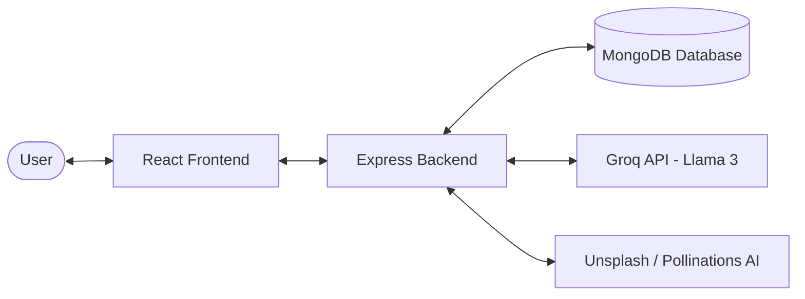

# AI Blog Generator

A full-stack web application that leverages AI to generate complete blog posts with images using Groq (Llama 3) and Unsplash. Users can create, edit, export, and manage AI-generated blog content with an intuitive, modern dark-themed interface.

---

## 📐 System Architecture

Below is a simplified diagram of how the client, server, database, and AI integrations connect:



---

## ✨ Key Features

- **🤖 AI-Powered Blog Generation** - Generates complete blog posts using Llama 3 models on Groq.
- **🎨 AI Image Generation** - Automatically retrieves relevant images using Unsplash API search queries based on the generated title (with Pollinations AI fallback).
- **🖼️ Image Upload** - Upload custom images from your local directory to add them to your articles.
- **✏️ Markdown Editor** - Edit blog content in a distraction-free monospace textarea with instant Markdown preview rendering.
- **🔄 Selected-Text AI Copilot** - Highlight any text block in the editor to rewrite, improve SEO keywords, or shift its tone using AI.
- **📤 Multiple Export Formats** - Export blogs to PDF, DOCX (Word), and Markdown.
- **🔐 User Authentication** - Secure signup/login with JWT-based sessions and password hashing.

---

## 🛠️ Tech Stack

### Frontend
- **React 18** - UI rendering
- **Vite** - Build tool and development server
- **Tailwind CSS 4** - Modern CSS framework with dark-theme glassmorphism styles
- **React Router DOM 7** - Client-side routing
- **React Markdown** - Markdown preview parser
- **Axios** - HTTP client

### Backend
- **Node.js** - Runtime environment
- **Express 5** - Web application framework
- **MongoDB & Mongoose** - Database storage and schema mapping
- **LangChain & Groq** - AI text generation workflows
- **pdfmake & html-to-pdfmake & jsdom** - PDF generation (pure JS, zero native dependencies)
- **@turbodocx/html-to-docx** - Word document builder (pure JS)
- **Turndown** - HTML-to-markdown conversion utility
- **Bcryptjs & Jsonwebtoken** - Hashing and authentication tokens

---

## 📁 File Structure

```
AI-Blog/
├── README.md                   # Project documentation
│
├── backend/                    # Backend server
│   ├── package.json           # Backend dependencies
│   ├── config/
│   │   └── db.js             # MongoDB connection setup
│   └── src/
│       ├── server.js         # Express server entry point
│       ├── controllers/      # Request handlers
│       │   ├── auth.controller.js
│       │   ├── blog.controller.js
│       │   ├── export.controller.js
│       │   ├── regenerate.controller.js
│       │   └── textRegeneration.controller.js
│       ├── middleware/        # Authentication middleware
│       │   └── auth.middleware.js
│       ├── models/           # Mongoose schemas
│       │   ├── blog.model.js
│       │   └── user.model.js
│       ├── routes/           # API routes
│       │   ├── auth.routes.js
│       │   └── blog.routes.js
│       ├── services/         # AI Service wrapper
│       │   └── ai.service.js
│       └── utils/            # Shared utilities
│           ├── errorHandler.js
│           └── validation.js
│
└── frontend/                  # Frontend application
    ├── package.json          # Frontend dependencies
    ├── vite.config.js        # Vite configuration
    ├── eslint.config.js      # ESLint configuration
    ├── index.html            # HTML entry point
    └── src/
        ├── main.jsx          # React entry point
        ├── App.jsx           # Main App component
        ├── index.css         # Global tailwind styles & animations
        ├── api/              # API clients
        │   ├── axios.js
        │   └── index.js
        ├── components/       # UI components
        │   ├── BlogGenerator.jsx
        │   ├── Export.jsx
        │   ├── ImageGallery.jsx
        │   ├── ProtectedRoute.jsx
        │   └── RichTextEditor.jsx
        ├── context/          # State management
        │   └── AuthContext.jsx
        └── pages/            # Page templates
            ├── Dashboard.jsx
            ├── Login.jsx
            └── Signup.jsx
```

---

## 🚀 Getting Started

### Prerequisites

- **Node.js** (v18 or higher)
- **MongoDB** (local server or Atlas cluster URI)
- **Groq API Key** (get one free at [console.groq.com](https://console.groq.com))
- **Unsplash Access Key** (optional, fell back to Pollinations AI if omitted)

---

### Environment Setup

#### 1. Backend Config
Create a `.env` file in the `backend/` directory:
```env
PORT=5000
MONGO_URI=mongodb+srv://<user>:<password>@cluster.mongodb.net/yourdb
JWT_SECRET=your_jwt_secret_token
GROQ_API_KEY=gsk_your_groq_api_key
UNSPLASH_ACCESS_KEY=your_unsplash_access_key
FRONTEND_URL=http://localhost:5173
NODE_ENV=development
```

#### 2. Frontend Config
Create a `.env` file in the `frontend/` directory:
```env
VITE_API_URL=http://localhost:5000/api
```

---

### Run Application Locally

1. **Start the Backend Server**:
   ```bash
   cd backend
   npm install
   npm run dev
   ```

2. **Start the Frontend Application**:
   ```bash
   cd ../frontend
   npm install
   npm run dev
   ```

3. Open your browser and navigate to `http://localhost:5173`.

---

## 👥 Contributors

Created by:
- [Kalpit Nagar](https://github.com/gitkrypton18)
- [Nikhil Nagar](https://github.com/Nikhil-X-codes)
